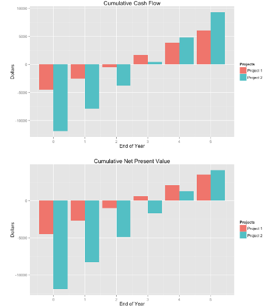

## Simple Metrics

1. When evaluating the financial metrics of an energy efficiency project, simple metrics such as Simple Payback (break-even point) and Return on Investment don't provide a complete picture.

2. Two projects, both with 10 year lifetimes:


```
##                             Project 1 Project 2
## 1          Initial Purchase       500      5000
## 2 First Year Energy Savings       100      1000
## 3                       ROI       0.2       0.2
## 4            Simple Payback         5         5
## 5             Total Savings       500      5000
```


3. Both projects have a payback of 5 years and an ROI of 20%.
4. But Project 2 returns $4500 more over its lifetime.

--- .class #id 

## Better Metrics

1. Instead of ROI and Simple Payback, two better measurs are Cash Flows and Net Present Value.
2. The cash flow metric (http://en.wikipedia.org/wiki/Cash_flow) gives you an idea of how a project will affect the amount of cash available to you or your business. This metric is important because without steady cash flow, your business will not be able to survive.
3. Net Present Value (http://en.wikipedia.org/wiki/Net_present_value) gives you an idea of cash flows over time when adjusting for inflation and considering other potential investment opportunities. In other words, is this the best use of my money or would it be better served in another type of investment.


--- .class #id 

## Better View
1. Let's take a look at two new projects with the following parameters:


```
##                             Project 1 Project 2
## 1         Cost of Equipment      5000     12500
## 2          Rebate/Incentive       500       600
## 3 First Year Energy Savings      2000      4000
```

2. We'll also assume a 5-year project lifetime, a 3% inflation rate, and a potential return of 10% if we invested that money in anothe project.

3. The Energy Efficiency Project Comparison Tool shows that over time, Project 2 is a better investement even with the higher up-front cost (see next slide).


--- .class #id 

## Tool Output
</img>
